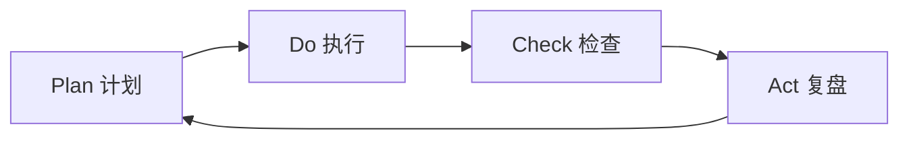
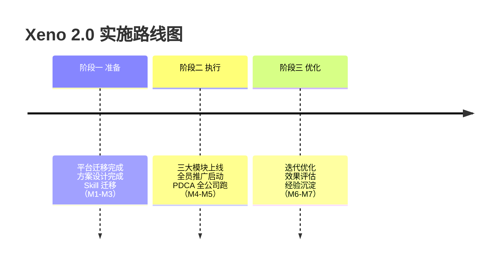

# Xeno 2.0 总体方案设计

> 创建时间：2026-05-06
> 基于：Xeno2.0规划文档 v1.1

---

## 一、Xeno 1.0 回顾总结

### Xeno1.0总体架构

### Xeno1.0小结

| 方向 | 目标 | 结果 |
|------|------|------|
| AI 驱动开发 | 统一工具和模型，建标准化 AI 开发环境 | 部分完成，缺乏体系化 |
| AI + Agent 团队管理 | 人+AI 工作模式，打通内部信息流 | 管理层 PDCA 已落地 |

**遗留问题**：
- AI 驱动开发缺乏体系化系统
- Skill 沉淀不够系统化
- OKR、项目管理模块未完成
- 全公司推广未启动

**进入 2.0 的核心判断**：1.0 验证了管理层 PDCA 可行，2.0 需将 AI 驱动从"个人工具"升级为"业务系统"，并推广到全员。

---

## 二、Xeno 2.0 目标与计划

**周期**：2026年4月20日 - 5月31日（约5周）

### 核心目标

| 方向        | 目标                        |
| --------- | ------------------------- |
| AI 驱动业务闭环 | 初步构建售前、项目管理、产品开发的 AI 驱动框架 |
| Agent驱动组织 | 全员 PDCA 循环落地，信息透明化        |

### 5月底里程碑

- 全员 Agent 100% 开通使用
- 售前方案生成时间缩短 50%
- 项目计划完成率提升至 80%+
- PDCA 全员每周执行

---

### 阶段一：准备（4月20日 - 4月30日，已完成）

| 事项 | 状态 |
|------|------|
| Hermes Agent 平台迁移 | 完成 |
| 方向一 + 方向二方案设计 | 完成 |
| 全员 Agent 分配方案 | 完成 |

### 阶段二：执行（5月4日 - 5月15日）

| 周次 | 关键动作 | 产出 |
|------|---------|------|
| 第1周（5/4-5/8） | Agent 全员开通、售前/项目 Skill 开发 | 每人可用 Agent，核心 Skill 上线 |
| 第2周（5/11-5/15） | 三大模块试运行、PDCA 模板分发、全员培训 | 试运行反馈，培训完成 |

### 阶段三：优化（5月18日 - 5月31日）

| 周次 | 关键动作 | 产出 |
|------|---------|------|
| 第3周（5/18-5/22） | 根据反馈迭代、全公司推广 | 全公司使用 |
| 第4周（5/25-5/31） | 效果评估、复盘总结 | Xeno 2.0 总结报告 |

---

## 三、总体架构


**一句话目标**：以 Hermes Agent 为底座，AI 驱动售前/项目/产品三大业务，PDCA 驱动组织升维。

---

## 四、技术底座

### 4.1 平台架构

| 层级 | 组件 | 说明 |
|------|------|------|
| Agent 平台 | Hermes Agent | 替代 OpenClaw，统一 AI 入口 |
| 人员覆盖 | 全员每人一个 Agent | 按角色分配 Skill 和权限 |
| Skill 库 | 可复用能力单元 | 从 1.0 迁移 + 2.0 新增 |
| 数据层 | 共享知识库 | 方案库、报价库、经验库、项目库 |

### 4.2 迁移路径

```
OpenClaw 现有 Skill → 适配 → Hermes Agent → 全员分发
```

### 4.3 负责人：佳汶

---

## 五、Agent 规划

### 5.1 角色与 Agent 分配

Agent 分为两类：

| 类型 | 访问规则 | 说明 |
|------|---------|------|
| **系统 Agent** | 全员可访问和问答 | 承担公司级业务职能 |
| **个人 Agent** | 仅系统 Agent + 本人可访问 | 个人工作助理 |

**系统 Agent**：

| Agent | 负责人 | 核心 Skill |
|------|--------|-----------|
| 管理Agent | 志勇 | 定时任务、公司任务总体检查 |
| 售前Agent | 志勇 | 方案生成（PPT+Word）、报价、市场机会跟踪 |
| PM Agent | 雪晴 | 项目计划、任务拆解、进度汇总、变更跟踪 |

**个人 Agent**：

| 归属  | Agent      | 核心 Skill     |
| --- | ---------- | ------------ |
| 个人  | 个人助手       | PDCA 四步、日常记录 |

**部署规则**：所有 Agent 均需拉入对应群聊。

### 5.2 Skill 清单

| Skill | 归属 | 说明 | 状态 |
|------|------|------|------|
| 方案生成 | 售前 Agent | RAG + LLM 生成 PPT/Word 方案 | 待开发 |
| 标准报价 | 售前 Agent | 规则引擎自动报价 | 待开发 |
| 市场机会跟踪 | 售前 Agent | 招投标/客户动态抓取与提醒 | 待开发 |
| 市场机会更新 | 售前 Agent | 机会状态追踪与进度同步 | 待开发 |
| 任务拆解 | PM Agent | AI 辅助 WBS 分解 | 待开发 |
| 进度汇总 | PM Agent | 每日/周自动汇总 | 待开发 |
| 偏差告警 | PM Agent | 阈值触发通知 | 待开发 |
| 项目计划 | PM Agent | 项目计划模板 + AI 排期 | 待开发 |
| 项目变更跟踪 | PM Agent | 变更记录与影响分析 | 待开发 |
| PDCA 模板 | 全员 | 计划/执行/检查/复盘 | 待适配 |

### 5.3 Agent 间协作

```
系统 Agent（全员可访问）
├── 管理Agent ──(定时检查)──→ 各系统 Agent + 个人 Agent
├── 售前Agent ──(项目交接)──→ PM Agent
└── PM Agent ──(任务分发)──→ 个人 Agent
                              ↓
                      共享知识库（方案库/报价库/经验库/项目库）
```

---

## 六、方向一：AI 驱动业务闭环

### 6.1 售前 AI 化

**目标**：从需求到方案到报价，AI 辅助全流程，30 分钟内出初稿。

| 模块 | 输入 | 输出 | 实现方式 |
|------|------|------|---------|
| 需求分析 | 客户沟通记录 | 结构化需求清单 | Agent + Prompt 模板 |
| 方案生成 | 需求清单 + 方案库 | 定制化方案文档 | RAG 检索 + LLM 生成 |
| 标准报价 | 方案模块清单 | 标准化报价单 | 规则引擎 + 模板填充 |
| 经验沉淀 | 每次售前过程 | 更新方案库/报价库 | 复盘 Skill 自动归档 |

**操作流程**：
1. 售前人员用 Agent 录入客户需求
2. Agent 检索历史方案，生成初版方案
3. 人工审核调整
4. Agent 根据方案自动生成报价
5. 项目结束后，复盘内容自动归档为经验资产

**负责人**：志勇

### 6.2 项目管理 AI 化

**目标**：每个项目有计划、有执行记录、有偏差告警、有复盘。

| 模块   | 功能                 | 实现方式            |     |
| ---- | ------------------ | --------------- | --- |
| 计划系统 | 项目计划模板 + AI 拆解 WBS | Agent 辅助分解任务    |     |
| 执行跟踪 | 每日/每周进度自动汇总        | Agent 收集 + 看板展示 |     |
| 偏差告警 | 进度/成本偏离自动提醒        | 阈值规则 + 通知推送     |     |
| 复盘机制 | 阶段结束自动生成复盘报告       | 模板 + 数据汇总       |     |

**操作流程**：
1. PM 创建项目，Agent 辅助拆解任务
2. 团队成员通过 Agent 更新进度
3. 系统自动对比计划 vs 实际，偏差超阈值告警
4. 里程碑结束自动触发复盘

**负责人**：雪晴

### 6.3 产品开发 AI 辅助

**目标**：用 AI 降低编码、测试、文档环节的人力依赖。

**编程工具**：Codex CLI + CLI 编程工具
**大模型**：OpenAI Plus（每人）+ 2 个 GLM 5.1 MAX 账号（共享）

| 环节 | AI 辅助方式 | 工具/方法 |
|------|------------|----------|
| 需求 → 设计 | AI 生成 PRD 和技术方案 | Agent + Skill |
| 编码 | AI 辅助编码、Code Review | Codex CLI |
| 测试 | AI 生成测试用例、自动化测试 | Agent + 测试 Skill |
| 文档 | AI 自动生成 API 文档、用户手册 | 代码 → 文档 Skill |

**负责人**：雪晴

---

## 七、方向二：Agen驱动组织

### 7.1 PDCA 闭环



| 环节 | 内容 | 工具 | 频率 |
|------|------|------|------|
| **P** | 个人 OKR + 周计划 + 项目计划 | Agent 辅助制定 | 季度/周 |
| **D** | 每日执行记录、进度更新 | Agent 快捷录入 | 每日 |
| **C** | 计划 vs 实际对比、偏差分析 | 自动生成 Check 报告 | 每周 |
| **A** | 复盘总结、改进项、经验沉淀 | Agent 引导复盘 | 每阶段 |

### 7.2 信息透明化

- **个人 OKR**：全员可见
- **项目进度**：实时看板，全公司可见
- **复盘报告**：全员共享
- **经验库**：全员可查

### 7.3 推广节奏

| 阶段 | 范围 | 时间 |
|------|------|------|
| 试点 | 管理层（延续 1.0） | 持续 |
| 扩展 | 核心团队（售前+项目+产品） | 5月第1周 |
| 全员 | 全公司 | 5月第2-3周 |

**负责人**：志勇

---

## 八、实施路线图



### 当前（5月初）关键动作

| 序号 | 动作 | 负责人 | 产出 |
|------|------|--------|------|
| 1 | Hermes Agent 全员开通 | 佳汶 | 每人一个可用的 Agent |
| 2 | 售前 AI Skill 上线 | 志勇 | 方案生成 + 报价 Skill |
| 3 | 项目 AI 看板上线 | 雪晴 | 计划-执行-跟踪看板 |
| 4 | PDCA 模板分发 | 志勇 | 每人 PDCA Agent 模板 |
| 5 | 全员培训 | 志勇 | 培训材料 + 实操演练 |

---

## 九、衡量标准

| 维度 | 指标 | 目标值（5月底） |
|------|------|---------------|
| 覆盖 | Agent 使用率 | 全员 100% |
| 售前 | 方案生成时间 | 缩短 50% |
| 项目 | 计划完成率 | 提升到 80%+ |
| 开发 | AI 辅助编码覆盖率 | 50%+ 代码 |
| 组织 | PDCA 执行率 | 全员每周完成 |

---

## 十、风险应对速查

| 风险 | 应对 |
|------|------|
| 平台不稳定 | 保留 OpenClaw 作为备用 |
| 推广阻力 | 管理层带头 + 每周公示使用率 |
| AI 输出质量 | 必须人工审核，积累反馈优化 |
| 时间不足 | 先跑通核心流程，细节迭代补 |

---

*文档版本：v1.0*
