# 矿卡综合运营管理平台 — 产品规划 V1.0

> **文档状态**：初稿 / 待评审
> **创建时间**：2026-05-13
> **作者**：宋志勇
> **调研来源**：2026-05-12 云南矿卡项目现场调研（蔡总、汽车/物流管理团队）

---

## 一、项目背

### 1.1 客户概况

| 维度   | 说明                          |
| ---- | --------------------------- |
| 总部   | 武汉                          |
| 主营业务 | 新能源大宗物流，运输磷矿石               |
| 年运量  | 500–800 万吨                  |
| 当前车队 | 自有车辆，下半年计划扩至 500 台          |
| 能源转型 | 燃油车 → 新能源（油价上涨 + 部分场所限制燃油车） |

### 1.2 现有平台现状

客户目前使用三套独立系统支撑业务运营：

| 平台          | 用途                 | 数据接口 | 源代码       | 关键问题               |
| ----------- | ------------------ | ---- | --------- | ------------------ |
| 智驭维科车辆管理平台  | 车辆管理、运单、调度、司机管理    | 全部开放 | 不提供，仅运行系统 | 以车辆台账为中心，非业务运营模型构建 |
| 　├ 后台端      | Web 管理后台           | —    | —         | 基础功能较全             |
| 　├ 手机 App 端 | 司机出车、接单、装卸货、报修     | —    | —         | 缺结算相关功能            |
| 　└ 中控屏端     | 车载中控，场站导航、围栏提示     | —    | —         | 与充电桩数据未打通          |
| 自建充电桩管理平台   | 充电桩状态监控与计费         | 自有接口 | 拥有全套源代码   | 与车辆平台数据未打通         |
| 飞书          | 内部办公业务管理（审批、沟通、文档） | —    | —         | 与业务系统完全割裂          |

**核心问题**：

- **上下游信息化薄弱**：矿场（上游）、收货方（下游）均无成熟信息平台，目前通过 Excel 或手填表单管理，数据源头即为非结构化数据
- **数据缺失严重**：磅单、货物重量、能耗数据靠司机拍照上传，手写磅单 OCR 识别率低
- **结算未打通**：运单结算需手动操作，工作流不完整，系统未真正投入使用
- **系统割裂**：车辆平台、充电桩平台、飞书办公三套系统互不联通，数据孤岛
- **AI 能力薄弱**：安全管理仍靠安全员培训司机，缺乏 AI + 视频主动预警
- **调度靠经验**：矿场发运计划不稳定，多为临时通知，缺乏预测能力

---

## 二、痛点分析与机会

| 痛点          | 现状            | 产品机会              |
| ----------- | ------------- | ----------------- |
| 发运计划不稳定     | 矿场临时通知，调度被动   | AI 运力预测 + 智能调度    |
| 数据采集低效      | 手写磅单、OCR 成功率低 | AI 磅单识别 + 传感器自动采集 |
| 结算流程断裂      | 手动对账，系统未用     | 打通磅单→运单→结算全链路     |
| 充电桩数据割裂     | 充电平台独立运作      | 车辆-充电-结算一体化       |
| 安全管理原始      | 安全员人工培训       | AI 视频行为分析 + 实时预警  |
| 单车 ROI 无法计算 | 数据分散          | 单车全生命周期数据跟踪       |
| 资产盘点低效      | 保险/年检/报废人工管理  | 资产工作流自动化 + 到期预警   |

---

## 三、产品定位

**矿卡综合运营管理平台** 是一套 AI Agent 驱动的新能源矿卡运营系统。以「人类决策 + Agent 执行」的协作模式，覆盖车辆从采购到报废的全生命周期，打通「车-桩-货-人-钱」五大要素。

### 核心理念：五个 AI Agent，一个运营大脑

平台内置五个垂直 AI Agent，各司其职：

| Agent | 角色 | 核心能力 |
|-------|------|---------|
| 🧠 调度 Agent | 运力调度副驾驶 | 分析矿场发运计划 + 历史数据 + 天气，预测运力需求，推荐派单策略 |
| 🛡️ 安全 Agent | 7×24 安全监督员 | 车载视频行为分析，疲劳/分心实时预警，司机安全画像 |
| 💰 结算 Agent | 自动化结算会计 | 磅单 AI 识别 → 运单生成 → 多维对账 → 结算单输出，全链路无人值守 |
| 📊 资产 Agent | 资产管家 | 保险/年检/维保到期预警，单车 ROI 实时计算，残值评估 |
| 🔗 数据 Agent | 数据连接器 | 打通智驭维科平台、充电桩平台、飞书，并将上下游 Excel/手填表单结构化 |

### 人机协作模式

- **Agent 负责**：数据采集、异常发现、模式预测、重复性操作、7×24 监控
- **人负责**：采购决策、客户关系、例外处理、策略审批、现场执行

**一句话定位**：一个运营大脑 + 五个 AI Agent，让 500 台矿卡像一台一样被管理。

---

## 四、矿卡综合运营管理业务流程

> 按「管车」和「管物流」两个维度划分：**管车**围绕车辆资产全生命周期，**管物流**围绕运输业务执行与结算。

### 🚛 管车 — 车辆资产全生命周期

#### 业务板块
管车覆盖六大业务模块：**车辆持车 → 车辆出库 → 车辆资产管理 → 车辆资产安全 → 车辆租售运营 → 数据归档**。

#### 业务岗位
事业部负责人：总体业务管理。（主要包含总经理和运营总监）
车务岗：主要负责实体车车辆交接和上牌。
车务数据岗：负责车相关的数据资料：证照、档案、保险的交接
车务安全岗：主要负责整个车的资产安全管理，包含资产安全、运行安全以及安全合规等。
租售销售岗：负责实体车出租和出售的市场拓展。

#### 4.1 车辆持车业务

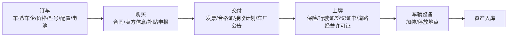

| 阶段   | 负责角色                    | 关键数据                         |
| ---- | ----------------------- | ---------------------------- |
| 订车   | 采购（总经办）                 | 车型、车企、价格、型号、配置、电池参数          |
| 购买   | 采购（总经办）/ 财务             | 合同件、卖方信息、补贴申报情况              |
| 交付   | 车务岗（实体接收）+ 车务数据岗（数据/保险） | 发票、合格证、接收计划、车厂公告             |
| 上牌   | 车务岗                     | 保险、归属持车公司、行驶证、车辆登记证书、道路经营许可证 |
| 车辆整备 | 车务岗                     | 加装信息、停放地点                    |
| 资产入库 | 车务岗                     | 资产入库登记、车辆状态                  |

#### 4.2 车辆出库业务

**自营出库**：

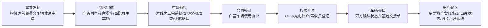

| 角色         | 职责                 |     |
| ---------- | ------------------ | --- |
| 物流运营部      | 需求发起               |     |
| 车务岗        | 资质审核、台账更新、车辆检测、交接  |     |
| 物流运营岗(车队长) | 试车、接车确认。（发起用权交接协议） |     |
| 事业部负责人     | 审批资产交接确认单          |     |


**租赁出库**：

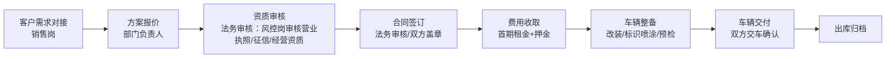

| 角色    | 职责        |
| ----- | --------- |
| 销售岗   | 客户对接、合同签订 |
| 运营岗   | 方案制定      |
| 法务    | 客户资质审核    |
| 财务岗   | 费用收取      |
| 车务岗   | 车辆整备、交付   |
| 车务数据岗 | 台账更新      |

#### 4.3 车辆资产管理业务

**购买保险管理**：

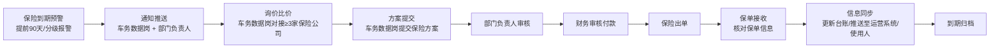
- 保险的到期预警的话是分级报警。
- 当保险到期预警触发后，是直接通知到车务数据岗和部门负责人
- 车务数据岗向保险公司进行询价和比价
- 车务数据岗提交方案，然后交由部门负责人；部门负责人审核完成之后，再提交到财务进行审核。
- 后续统一考虑一下，是否需要把付费流程拆分出来，做一个单独的通用流程。
- 保险购买流程如下：
1. 由车务数据岗发起
2. 部门负责人审核
3. 财务付款

**索赔管理**：

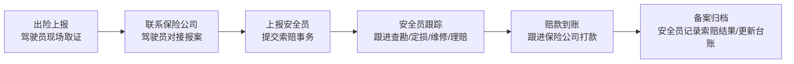
- 出险上报：由驾驶员现场取证，以及联系保险公司来进行对接处理。处理完后，需要将索赔事务上报给安全员，由安全员在后续环节中统一跟踪。
- 索赔处理：在该业务流中，主要是安全员用于跟踪整个索赔的进展和进行备案记录。


**年检年审**：

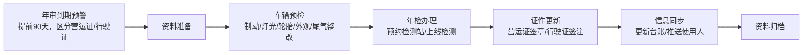
- 原审到期预警的话是通知到车务数据岗和部门负责人。
- 车务数据岗准备年审资料。
- 由车务岗进行现场实施，具体包括：
1. 车辆预检
2. 年检办理
3. 证件更新
4. 信息同步
- 办完资料之后，由车务岗进行资料上传，由车务数据岗审核归档。

**维修保养**：

1、定期保养流程

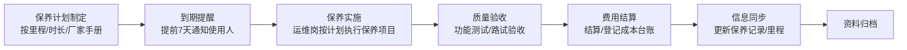
- 车务岗制定保养计划。
- 车务数据岗审核保养计划
- 定时保养到期之后，车务岗根据定时保养的清单进行定时保养的操作。
- 完成之后，应该会提供一个定时保养的报告并进行上传。（定时保养相关的数据。）

2、故障维修流程

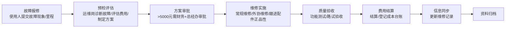
- 故障报修的发起人是司机。
- 车务岗负责处理故障报修申请。
- 车务岗根据故障情况，提交故障的维修方案及相关的费用评估。随后根据费用金额，分别提交至财务部门或总办。
- 后续所有的处理流程都是由车务岗来进行跟踪。

**违章管理**
定周期，统一录入违章信息。负责岗位：车务数据岗
遗留问题：12123是否可以接到车管所的推送信息。（需要去沟通和了解）

| 角色    | 职责                       |
| ----- | ------------------------ |
| 车务数据岗 | 到期预警、信息同步                |

#### 4.4 车辆资产安全业务
**安全计划制定流程**
- 由安全岗进行安全计划的制定。
- 安全计划制定之后，提交部门负责人审核。

**安全管理流程**（需要考虑到外租和内部租用两种情况）
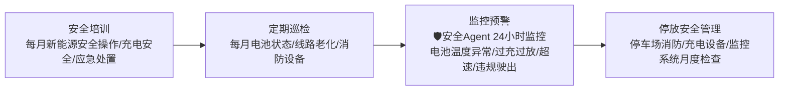
- 停放安全是根据电子围栏。电子围栏，就是根据现在车辆管理平台上面划定的区域来进行识别和管理。
- 监控预警是根据车辆的状态监控数据，进行监控告警的上报和分析。
- 安全管理要形成安全管理的周报，并且上报到部门负责人。

**风险事件处理**：

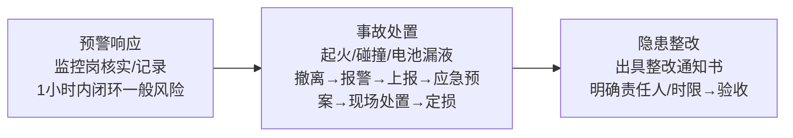
- 安全管理岗：接收到风险事件处理的通知，生成安全事件工单。（包括事件和隐患）
- 安全岗根据安全事件工单，如果是风险事件，则进行事件处理，生成事件处理报告，上报归档。
- 如果是隐患，生成隐患整改通知单，下发到责任人进行整改，生成隐患整改报告后，上传审核（安全岗审核）归档。

**安全审计优化**：

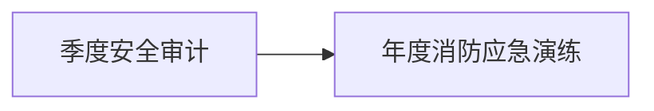
- 整合到安全管理流程中，作为安全管理计划的任务。

| 角色 | 职责 |
|------|------|
| 安全管理岗 | 制度制定、培训、事故处理、审计 |
| 数据监控岗 + 🛡️安全Agent | 24小时实时监控、预警响应 |
| 运维岗 | 车辆安全巡检 |
| 车务岗 | 停车场安全管理 |
| 驾驶员 | 日常安全操作、事故上报 |

#### 4.5 车辆租售运营业务
- 对外提供车辆租售门户。
- 对内工作流程：

**车辆租售订单处理流程**
- 由租售市场人员发起车辆租售的一个订单。
- 其他部门管理员首先进行审核。
- 部门负责人审核完之后，提交到法务和财务审核。
- 审核完成之后，由租售市场人员进行合同签订。
- 合同签订之后，系统会生成一个车辆租售运营的项目。

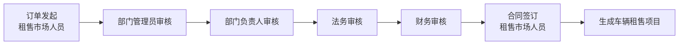

**车辆租售运营流程**
1、租金催收流程
- 系统根据出租情况，提前向租户发送短信通知，提醒其交租。
- 同时通知到对应的市场销售人员。
- 市场销售人员处理对应的通知，完成整个催促过程的反馈。

2、客户服务流程
- 客户通过电话接入，提取客户服务信息，随后生成一个客服工单。
- 客服人员处理服务工单，填写服务反馈之后，完成服务的闭环。（客户服务有哪些类型？维修、保险、车辆状态、业务相关、投诉处理）

**退租处置流程**：（包含整成合同结束）
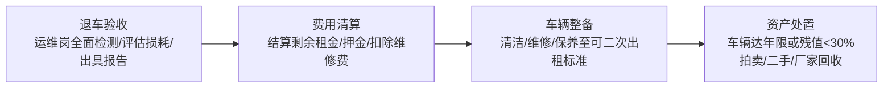
- 退租由销售发起退租申请。
- 由车务岗进行退车验收（验收单、车厂报告、车损费用单、租金结算单、违约金计算（如果是合同结束，则无此项））。
- 提交到财务审核，并且完成财务处理部分。
- 车务岗进行车辆整备，以及资产处置，处置申请提交到部门负责人审核处理意见。
- 车务数据岗准备完之后，进行台账更新。

**以租代售流程**
- 考虑到退租处置流程中，差别点是合同结束之后，整个退租直接跳到整个资产出库的流程。（由车务数据岗再更新台账）


### 📦 管物流 — 新能源物流事业群全流程

#### 业务板块
管物流分为四大阶段：**物流业务承接 → 物流业务运营 → 结算 → 收款**。

#### 岗位定义
部门负责人：主要负责整个部门的业务管理。（包含部门的总经理、部门总监）
市场专员：负责物流业务项目的开发和拓展。
规划专员：负责项目踏勘、项目的可实施方案以及成本测算。
物流客服：订单对接、协助回款跟进。
调度专员：运输计划的匹配、运力匹配以及在途监管。
车队长：驾驶员招聘、驾驶员档案管理、驾驶员安全管理。
驾驶员：运输计划的执行、维修的报备以及异常报备。
数据专员：运输数据的统计与汇总，以及成本费用的统计与汇总。
结算专员：运输明细与磅单的核对，发起结算流程。
驻场专员：运输计划的装卸货现场执行与管理。

#### 4.6 市场拓展与项目承接

**商机管理**：

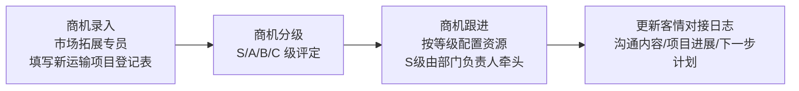
- 由市场专员将项目的商机填报到系统。（商机状态：初步线索、现场踏勘、通过立项、关闭、完成）
- 由市场专员和规划专员去现场踏勘，形成项目调研方案报告，进行提交，由部门负责人审核。
- 如果审核通过，则进入下一步流程：可行性分析、成本核算以及项目立项资料。
- 然后再发起项目立项申请。

**项目预立项与评估**：

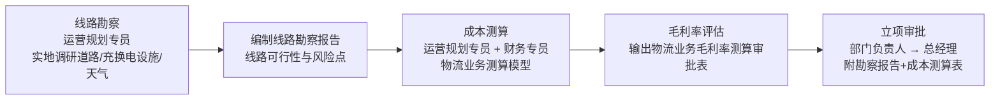
- 由市场专员发起立项，由部门负责人首先完成审批，然后根据商机的不同等级进行不同的处理。
- 项目立项最终由总经理确认。
- 项目立项完成进入执行阶段的时候，项目会派发到部门负责人，由部门负责人来将项目进行拆分，或者指定到对应的调度专员。（同一个调度专员可以负责多个项目，项目和调度专员之间是多对多的关系）

**招投标与合同管理**：

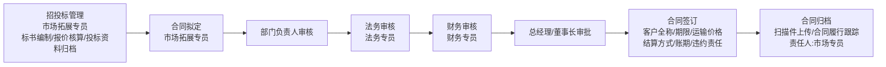
- 在招投标管理中，其核心主要是招投标资料的存档与归档。
- 合同履行的责任人是市场专员。
- 合同审核中还需要增加财务审核。
- 整个合同评审的过程，由专员首先拟定合同，之后提交给部门负责人。由部门负责人进行审核，审核通过之后再提交给法务以及财务，最终提交给总经理和董事长审核。

| 阶段   | 负责角色         | 关键数据                             |
| ---- | ------------ | -------------------------------- |
| 商机录入 | 市场拓展专员       | 客户名称、线路起点/终点、预估货量、期望价格、结算方式、商机等级 |
| 商机跟进 | 市场拓展专员       | 跟进日志(沟通时间/对象/内容/下一步计划)           |
| 线路勘察 | 运营规划专员       | 道路类型占比、坡度路段、充换电站点、季节影响因素、超限检测站   |
| 成本测算 | 运营规划专员/财务专员  | 能耗成本、司机成本、车辆折旧、维保成本、路桥杂费、预计毛利率   |
| 立项审批 | 部门负责人/总经理    | 审批意见、签字记录，状态：待审批/已通过/已驳回         |
| 招投标  | 市场拓展专员       | 标书文件、报价方案、投标结果记录                 |
| 合同签订 | 市场拓展专员/法务/财务 | 客户全称、合同期限、运输价格、结算方式、账期、违约责任      |

#### 4.7 运输运营

**订单接收与确认**：

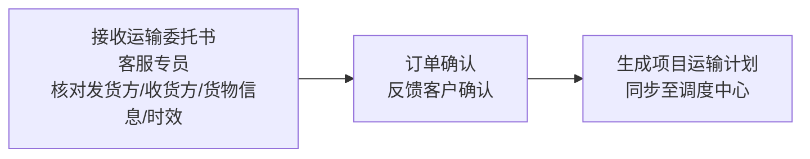
- 项目立项之后，由客服或者是调度去对接客户的需求。
- 由客服或者调度生成一个订单，在订单中要求包括：业主的需求、线路、运量等。
- 订单有几个状态：创建、执行中、执行完。
- 订单在转为执行状态的时候，就应该流转到调度专员，由调度专员根据订单以及运力匹配情况，生成运输计划。
- 订单完成之后会进入结算流程，然后由结算专员负责。
- 订单与项目专员是一对一的关系。

**运力匹配与调度**：

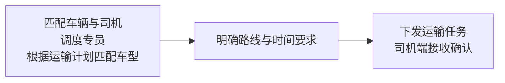
- 订单执行完成之后，进入到结算流程，由结算专员负责。
- 运力匹配由调度专员负责。调度专员会根据当天的订单情况，进行第二天运力的匹配和调度。
- 关于运力匹配与调度：
1. 运力匹配流程
   运力匹配涉及匹配车与司机、调度专员以及匹配车型等方面。关于运力匹配的操作方向，主要分为以下两个阶段：
   (a) 项目立项阶段：在创建项目时，首先要进行资源的初步估算。根据甲方的需求，测算大概需要多少台车才能满足预期。
   (b) 订单执行阶段：由于甲方发出的需求通常会有时间批次或节奏，不会一次性全部上马，因此计划会随之变动。
2. 资源调度逻辑
   (a) 资源估算：项目立项过程主要是对资源的宏观估算。
   (b) 精准匹配：在实际执行中，需要进行精准的运力匹配。例如，今天需要调动 5 台车，明天 10 台车，后天可能又降回 5 台车。
   (c) 调度方式：资源匹配并非单纯按照单个订单去调动，而是根据所有订单的总体计划，灵活规划未来 2 到 3 天的运力，进行统一调度。
这种调度工作是每天都需要进行的。
- 需要考虑到存在磅差或者是车辆故障导致的异常执行情况下，对整个域内匹配的影响和调整。
- 一个订单在运力匹配完之后，可能拆分为多条线路或者是多个负责的驾驶员，所以它会以拆分为多个任务的方式来进行。
- 对于部门负责人，他看到的是项目；对于调度专员，他看到的是订单；对于司机驾驶员，看到的是任务。
- 调度专员在进行运力匹配和分解任务时，也会去估算整个订单的执行周期和时间。

**车辆与司机准备**：

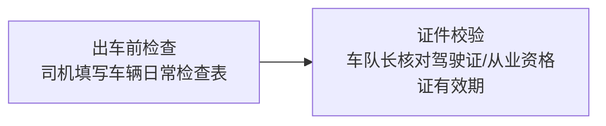
- 司机在移动端接收到了运输任务；
- 在出车前，司机需要按照检查的 Checklist 生成车辆的检查日志。确认 OK 之后提交。
- 系统要求支持对于司机的证照管理。对于证照即将到期的情况，需要通过APP推送给车队长或驾驶员，以便进行后续证照更新。

**装货与交接**：


- 在装货的过程中，驾驶员需要通过移动端上传磅单。
- 驾驶员的具体操作流程如下：
1. 上传磅单
2. 拍照并上传仪表盘中的公里里程数。（需要识别图片，提取仪表盘中的公里数和 SoC。）
- 驾驶员上传磅单就默认开始发车。

**在途管理与监控**：

```mermaid
graph LR
    A[GPS实时监控<br/>调度中心每2小时<br/>监控位置/路线/速度] --> B[异常上报<br/>司机遇故障/事故/拥堵立即上报]
    B --> C[异常处理<br/>调度启动处理流程<br/>响应时间≤30分钟]
```
- 在该过程中没有业务流程。
- 异常提报功能，在驾驶员移动端和调度中心端都要求支持上报端口。


**卸货与回单管理**：

```mermaid
graph LR
    A[卸货交接<br/>司机与收货方核对货物] --> B[获取卸货磅单<br/>+ 签收凭证]
    B --> C[拍照上传系统<br/>司机上传磅单与签收凭证]
    C --> D[回单核对与归档<br/>客服专员3个工作日内完成]
```
- 卸货交接完成之后，司机通过移动端上传卸货的磅单。（在这个环节也是需要拍磅单和仪表盘的图片）
- 在大宗运输中，磅单就相当于是签收凭证。
- 回端的话应该是流转到调度中心，由调度专员处理。
- 卸货环节的异常为：磅差。

| 阶段 | 负责角色 | 关键数据 |
|------|---------|---------|
| 订单接收 | 客服专员 | 订单编号、发货方/收货方信息、货物品名/重量、时效要求 |
| 运力匹配 | 调度专员 | 调度单号、车牌号、司机ID、运输路线、预计出发/到达时间 |
| 出车准备 | 司机/车队长 | 车辆检查项(刹车/轮胎/电量/证件)、证件有效期校验 |
| 装货 | 司机 | 空车重量、装货后总重、货物净重(自动计算)、磅单照片 |
| 在途监控 | 调度专员/司机 | GPS定位(经纬度/速度/方向)、异常类型/上报时间/处理记录 |
| 卸货回单 | 司机/客服专员 | 卸货净重(与装货差异超合理范围触发预警)、签收凭证照片 |

#### 4.8 司机与车辆管理

**司机招聘与入职**：

```mermaid
graph LR
    A[驾驶员招聘<br/>车队长/人事专员] --> B[资质审核<br/>身份证/驾驶证/从业资格证<br/>无犯罪记录/毒检报告]
    B --> C[安全与操作培训<br/>培训考核合格]
    C --> D[签订劳动合同<br/>建立驾驶员档案]
```
- 司机招聘与入职，主要就是司机入职之后的建档流程。
- 目前司机由第三方劳务公司签订合同，因此在司机档案中，要求进行合同的基础信息管理。
- 驾驶员档案中需要包含以下材料：
1. 驾驶员身份证
2. 驾驶证
3. 从业资格证
4. 体检报告
5. 无犯罪记录证明
6. 毒检报告
- 此处需要增加车队管理。

**驾驶员考勤与薪酬核算**：
```mermaid
graph LR
    A[每日出勤记录<br/>车队长] --> B[月度统计<br/>出勤天数/行驶里程/趟次]
    B --> C[薪酬核算<br/>财务专员<br/>基薪+提成+全勤奖+安全奖-扣款]
```
- 报销申请：司机的移动 APP 端要求有一个报销申请功能（可由车队长、调度提起）。具体流程如下：
1. 司机提出报销申请
2. 提交到部门负责人进行审核
3. 审核通过后流转到财务进行支付
- 提供驾驶员的考勤报表（出车时间和里程），可生成报表。驾驶薪酬是通过固定薪酬+里程薪酬（考虑空载和重载里程的不同计酬）
- 里程需要考虑重载和空载里程的计算算法。（后续实现的时候需要讨论算法。）
**车辆运维管理**：

```mermaid
graph LR
    A[故障上报<br/>司机上报车辆异常] --> B[进厂维修<br/>维修专员安排]
    B --> C[维修验收<br/>记录费用与配件更换]
    C --> D[定期保养<br/>按里程/时长自动提醒]
```

- 处理流程同车辆管理中的保修流程。
- 费用归属上，需要区别部门。

| 阶段 | 负责角色 | 关键数据 |
|------|---------|---------|
| 司机招聘 | 车队长/人事专员 | 姓名/身份证号/驾驶证/从业资格证/无犯罪记录/毒检报告/培训考核结果 |
| 考勤薪酬 | 车队长/财务专员 | 出勤状态、重驶里程、空驶里程、全勤奖、安全奖、扣款/处罚、实发工资 |
| 车辆运维 | 车队长/维修专员 | 车辆ID、异常类型、维修时间/费用、配件更换记录、保养周期提醒 |

#### 4.9 结算与回款

**对账管理**：

```mermaid
graph LR
    A[核对运输明细及磅单<br/>客服专员/财务专员] --> B[生成对账单<br/>运输吨数/金额/扣款]
    B --> C[提交客户核对<br/>确认双方无异议]
```
- 对账管理的结算颗粒度应该到任务级。对账专员定期选择订单中已完成的任务（或者叫运输计划），生成出入库确认单，并与业客户方核对。客户方确认盖章之后，由结算专员上传出入库确认单（是货物），再生成结算单（和甲方确认，主要用户付款），流转到结算流程。
- 

**结算与开票**：

```mermaid
graph LR
    A[生成结算单<br/>财务专员<br/>基于对账结果] --> B[双方签字盖章确认]
    B --> C[按合同开具发票]
    C --> D[发票发送至客户]
```
- 用户对结算单签字盖章之后，由结算专员再上传。
- 结算专员上传结算单之后，订单流转到财务进行开票。开票完成后，系统进入等待回款状态（回款中状态）。流程进入到回款流程。

**回款管理**：

```mermaid
graph LR
    A[跟进回款<br/>财务专员/市场拓展专员] --> B[到账核销<br/>记录回款金额/时间]
    B --> C[逾期催收<br/>超合同账期自动标记逾期<br/>启动催收流程]
```
- 回款的负责人是由客服或者是市场来负责。
- 由客服或者市场来跟踪回款状态，上传付款凭证或水单，随后完成整个订单流程。

| 环节 | 负责角色 | 关键产出 |
|------|---------|---------|
| 对账 | 客服专员/财务专员 | 对账周期、运输总吨数、总运输金额、扣款金额、对账结果 |
| 结算开票 | 财务专员 | 结算单号、发票号码、发票金额、发票寄出时间 |
| 回款 | 财务专员/市场拓展专员 | 回款金额、回款时间、账期天数、逾期状态 |

#### 4.10 供应商管理

**供应商准入**：

```mermaid
graph LR
    A[资质审核<br/>供应商管理专员<br/>营业执照/道路运输许可证/车辆信息/安全记录] --> B[纳入合格供应商名录]
```
- 该流程主要用于找第三方物流公司承运业务。
- 需要新增第三方供货商的账号和权限管理。
- 需要维护一个第三方供应商的台账信息。

**供应商考核与分级**：

```mermaid
graph LR
    A[季度考核<br/>供应商管理专员] --> B[评分定级<br/>A级优秀/B级良好/C级合格/D级不合格]
    B --> C[分级管理<br/>A级:订单优先/付款优惠<br/>C级:整改/减少订单<br/>D级:启动退出]
```
- 在进行订单指派时，如果指派的是第三方供应商，系统需提供相应的端口权限。具体流程如下：
1. 权限与访问
   第三方供应商的调度专员通过端口访问系统，获取并处理相关订单。
2. 资料提交与流转
   第三方供应商最终需提供以下单据，以提交并完成整个订单的流转过程：
   (a) 出库单
   (b) 结算单
- 供应商考核与分级：主要就是对供应商信息的一个维护。

| 考核维度 | 权重 | 目标值 |
|---------|------|--------|
| 运营服务质量 | 40% | 准点率≥98%，货损货差率达标，回单及时率≥98% |
| 成本与控制 | 20% | 价格竞争力，结算准确率100% |
| 安全性 | 20% | 事故率≤1次/百万公里，理赔配合度 |
| 协同与响应 | 10% | 响应时间≤1小时，异常处理配合度 |
| 合规与信誉 | 10% | 无资质过期，无重大法律纠纷 |

---

## 五、用户角色

> 按「管车」和「管物流」两个维度划分，覆盖从决策层到执行层的完整角色体系。

### 管理层

| 角色 | 所属板块 | 核心职责 |
|------|---------|---------|
| 总经办 / 总经理 / 董事长 | 全局 | 车辆采购决策、项目立项最终审批、合同终审、大额维修费用联审（>5000 元）、经营分析 |
| 事业部负责人 / 部门负责人 | 全局 | 业务管理统筹、资产交接审批、方案审核（含保险方案/安全计划/租售方案）、部门审批、项目拆分与调度指派 |

### 🚛 管车 — 车辆资产管理

| 角色            | 核心职责                                                                                                          |
| ------------- | ------------------------------------------------------------------------------------------------------------- |
| 车务岗           | 车辆实体接收与交接、上牌办理、车辆预检/整备、出库交付、退车验收（验收单/车厂报告/车损费用单）、退租车辆整备、停车场安全管理、保养计划制定与实施、故障报修申请处理与维修方案/费用评估提交、维修全流程跟踪、年检资料上传 |
| 车务数据岗         | 证照/档案/保险资料管理、保险到期预警与询价比价（对接 ≥3 家保险公司）、年审到期预警与资料准备、保养计划审核、违章信息录入、台账更新、资料归档审核                                   |
| 车务安全岗 / 安全管理岗 | 安全制度制定、安全培训组织、安全计划制定、安全事件工单生成与分发（含事件/隐患）、事故/隐患处理与跟踪、隐患整改通知单下发与验收审核、安全周报上报、季度安全审计、年度消防应急演练                     |
| 租售销售岗 / 销售岗   | 客户需求对接、合同签订、租售订单发起、退租申请发起、租金催收处理、市场拓展                                                                         |
| 运维岗           | 车辆三电系统检测、故障诊断与维修方案制定、保养实施、维修质量验收、退租车辆全面检测与损耗评估报告出具、车辆安全巡检                                                     |
| 数据监控岗         | 24 小时实时监控、预警响应与核实记录（1 小时内闭环一般风险）、配合 🛡️ 安全 Agent 处理预警                                                         |
| 采购（总经办）       | 订车/购买决策、合同签订、补贴申报                                                                                             |
| 运营岗           | 租赁出库方案制定与报价                                                                                                   |


### 📦 管物流 — 运输业务运营

| 角色            | 核心职责                                                                                                     |
| ------------- | -------------------------------------------------------------------------------------------------------- |
| 市场专员 / 市场拓展专员 | 商机录入与跟进、客户对接、招投标管理（标书编制/归档）、合同拟定与履行跟踪、回款跟踪                                                               |
| 规划专员 / 运营规划专员 | 线路勘察与踏勘、编制线路勘察报告（含可行性与风险点）、成本测算、可行性方案编制                                                                  |
| 物流客服 / 客服专员   | 运输委托接收与订单确认、生成订单（含业主需求/线路/运量信息）、回单核对与归档（3 工作日内）、对账管理、回款跟进、客户服务工单处理（维修/保险/车辆状态/业务/投诉）                     |
| 调度专员          | 订单接收与管理、运力匹配（车辆+司机+车型，每日）、运输计划制定与任务拆分、订单执行周期估算、在途监管（每 2 小时监控 GPS 位置/路线/速度）、回单处理、异常处理（响应 ≤30 分钟）          |
| 车队长           | 驾驶员招聘、驾驶员档案管理（证照/合同/体检/培训考核）、驾驶员安全管理、出车前检查校验、证照到期 APP 推送管理、每日考勤记录、报销申请提起（可由调度发起）                         |
| 驾驶员 / 司机      | 运输任务执行、出车前 Checklist 检查与日志生成、磅单拍照上传（装货与卸货各一次）、仪表盘里程/SoC 拍照上传、故障/事故/拥堵异常上报、出险现场取证与联系保险公司报案、索赔事务上报安全员、报销申请 |
| 驻场专员          | 运输计划装卸货现场执行与管理                                                                                           |
| 结算专员          | 运输明细与磅单核对、生成出入库确认单并与客户确认、发起结算流程、生成结算单并上传                                                                 |
| 数据专员          | 运输数据统计与汇总、成本费用统计与汇总                                                                                      |

### 💰 财务与法务

| 角色 | 核心职责 |
|------|---------|
| 财务岗 / 财务专员 | 保险付款审核、维修费用审核（>5000 元需总经办联审）、租金/押金/违约金结算、费用收取（租赁出库首期租金+押金）、开票管理、回款核销、薪酬核算（基薪+里程提成+全勤奖+安全奖−扣款）、成本测算配合（物流业务测算模型）、租售订单财务审核 |
| 法务专员 | 客户/供应商资质审核（营业执照/征信/经营资质）、合同法律审核、风控 |

### 👥 人事

| 角色 | 核心职责 |
|------|---------|
| 人事专员 | 配合车队长完成驾驶员招聘、劳动合同管理 |

### 🏢 供应商管理

| 角色 | 核心职责 |
|------|---------|
| 供应商管理专员 | 供应商资质审核（营业执照/道路运输许可证/车辆信息/安全记录）、合格供应商名录维护、季度考核与评分定级（A/B/C/D 级）、分级管理执行（订单优先/整改减少/启动退出） |
| 维修专员 | 车辆进厂维修安排、维修费用与配件更换记录 |

### 🔗 外部角色

| 角色 | 核心职责 |
|------|---------|
| 第三方供应商 | 通过端口接收承运订单、提交出库单与结算单、接受考核分级管理 |
| 第三方供应商调度专员 | 通过端口访问系统获取并处理订单 |

---

**角色总计**：覆盖 7 大类、25+ 个岗位角色，从战略决策层（总经办）到现场执行层（驾驶员/驻场专员），形成完整的矿卡运营管理角色体系。

---

## 六、系统架构

```mermaid
graph BT
    subgraph L5["⑤ 智能体层（AI Agents）"]
        direction LR
        L5A[🧠 调度Agent] --- L5B[🛡️ 安全Agent] --- L5C[💰 结算Agent] --- L5D[📊 资产Agent] --- L5E[🔗 数据Agent]
    end

    subgraph L4["④ 数据服务层"]
        direction LR
        L4A[车辆数据服务] --- L4B[运单数据服务] --- L4C[结算数据服务] --- L4D[能耗数据服务] --- L4E[资产数据服务] --- L4F[安全数据服务]
    end

    subgraph L3["③ 业务流程层"]
        direction LR
        subgraph L3A["🚛 管车"]
            L3A1[车辆持车] --- L3A2[车辆出库<br/>自营/租赁] --- L3A3[车辆资产管理<br/>保险/索赔/年检/维保/违章] --- L3A4[车辆资产安全<br/>安全计划/监控预警/风险处置/审计] --- L3A5[车辆租售运营<br/>订单/催收/客服/退租/以租代售] --- L3A6[数据归档]
        end
        subgraph L3B["📦 管物流"]
            L3B1[市场拓展<br/>商机/踏勘/立项/招投标/合同] --- L3B2[运输运营<br/>订单接收/运力匹配/在途监控/回单] --- L3B3[司机与车辆管理<br/>招聘/考勤薪酬/运维] --- L3B4[结算与回款<br/>对账/开票/催收] --- L3B5[供应商管理<br/>准入/考核分级]
        end
        L3A ~~~ L3B
    end

    subgraph L2["② 数据底座"]
        direction LR
        L2A[IoT 数据采集<br/>GPS/车载T-Box/充电桩] --- L2B[磅单 AI 识别<br/>装货/卸货磅单OCR] --- L2C[视频数据采集<br/>车载视频/行为分析] --- L2D[数据清洗与标准化] --- L2E[统一 API 网关] --- L2F[数据存储<br/>时序/文档/关系型]
    end

    subgraph L1["① 业务系统层（现有外部系统）"]
        direction LR
        L1A[智驭维科车辆平台<br/>API 对接] --- L1B[自建充电桩平台<br/>源码级集成] --- L1C[飞书<br/>审批/消息推送] --- L1D[上下游<br/>Excel/手填表单/磅单]
    end

    L1 --> L2
    L2 --> L3
    L3 --> L4
    L4 --> L5
```

### 架构分层说明

| 层级 | 名称 | 说明 |
|------|------|------|
| ① 业务系统层 | 现有外部系统 | 客户当前使用的智驭维科车辆平台、自建充电桩平台、飞书，以及上下游 Excel/手填表单。通过 API、源码集成、消息推送等方式对接 |
| ② 数据底座 | 数据采集与标准化 | IoT 数据采集（GPS/车载 T-Box/充电桩）、磅单 AI 识别、车载视频采集、数据清洗与标准化、统一 API 网关、混合存储（时序/文档/关系型） |
| ③ 业务流程层 | 管车 + 管物流 | 对应第四章全部业务流程。管车覆盖持车→出库→资产管理→资产安全→租售运营→归档 6 大模块；管物流覆盖市场拓展→运输运营→司机与车辆管理→结算与回款→供应商管理 5 大模块 |
| ④ 数据服务层 | 领域数据服务 | 按业务域抽象：车辆、运单、结算、能耗、资产、安全六大领域数据服务，对上支撑 Agent 调用，对下聚合数据底座能力 |
| ⑤ 智能体层 | 五个 AI Agent | 调度 Agent（运力预测与派单）、安全 Agent（视频行为分析与预警）、结算 Agent（磅单识别→对账→结算全链路）、资产 Agent（保险/年检/维保预警+ROI 计算）、数据 Agent（跨系统数据连接与上下游结构化） |

### 架构与业务流程对照

| 第四章业务流程 | 架构对应层 | 关键支撑 |
|--------------|-----------|---------|
| 4.1 车辆持车 | L3A 车辆持车 | L2 IoT 数据采集 + L4 资产数据服务 + L5 数据 Agent |
| 4.2 车辆出库（自营/租赁） | L3A 车辆出库 | L2 统一 API + L4 车辆数据服务 |
| 4.3 车辆资产管理（保险/索赔/年检/维保/违章） | L3A 车辆资产管理 | L4 资产数据服务 + L5 资产 Agent（到期预警） |
| 4.4 车辆资产安全 | L3A 车辆资产安全 | L2 视频数据采集 + L4 安全数据服务 + L5 安全 Agent（24h 监控） |
| 4.5 车辆租售运营 | L3A 车辆租售运营 | L1 飞书（消息推送）+ L4 资产数据服务 |
| 4.6 市场拓展与项目承接 | L3B 市场拓展 | L1 飞书（审批）+ L2 统一 API + L5 调度 Agent（运力预测） |
| 4.7 运输运营 | L3B 运输运营 | L2 IoT/磅单 AI/视频 + L4 运单数据服务 + L5 调度 Agent |
| 4.8 司机与车辆管理 | L3B 司机与车辆管理 | L4 车辆数据服务 + L5 安全 Agent（司机画像） |
| 4.9 结算与回款 | L3B 结算与回款 | L2 磅单 AI 识别 + L4 结算数据服务 + L5 结算 Agent |
| 4.10 供应商管理 | L3B 供应商管理 | L2 统一 API + L5 数据 Agent |

> **架构核心原则**：数据底座统一采集、清洗、标准化 → 业务流程层编排管车/管物流双线流程 → 数据服务层按域抽象 → AI Agent 层以「人类决策 + Agent 执行」模式驱动各环节智能化。


---

## 七、核心模块详述

> 按「管车」和「管物流」两个维度组织，与第四章业务流程一一对应。各模块标注对应业务流程编号。

### 🚛 管车 — 车辆资产全生命周期

#### 7.1 车辆持车管理（← 4.1）

覆盖「订车→购买→交付→上牌→整备→资产入库」全链路。

| 阶段 | 功能要点 | 负责角色 |
|------|---------|---------|
| 订车 | 车型/车企/价格/型号/配置/电池参数录入 | 采购（总经办） |
| 购买 | 合同件管理、卖方信息、补贴申报情况跟踪 | 采购（总经办）/ 财务 |
| 交付 | 发票/合格证上传、接收计划、车厂公告归档 | 车务岗（实体）+ 车务数据岗（数据/保险） |
| 上牌 | 行驶证/车辆登记证书/道路经营许可证录入、保险绑定、归属持车公司关联 | 车务岗 |
| 车辆整备 | 加装信息记录（雨棚/水箱等）、停放地点登记 | 车务岗 |
| 资产入库 | 资产入库登记、车辆状态初始化、台账生成 | 车务岗 |

#### 7.2 车辆出库管理（← 4.2）

**自营出库**：需求发起（物流运营部）→ 资格审核 → 车辆预检（三电系统/外观/续航）→ 合同签订 → 权限开通（GPS/充电账户/驾驶员登记）→ 车辆交接 → 出库登记

**租赁出库**：客户需求对接（销售岗）→ 方案报价 → 资质审核（法务：营业执照/征信/经营资质）→ 合同签订 → 费用收取（首期租金+押金）→ 车辆整备 → 车辆交付 → 出库归档

| 功能要点 | 说明 |
|---------|------|
| 出库审批工作流 | 自营/租赁双流程，按角色配置审批节点 |
| 车辆预检 | 三电系统检测、外观检查、续航确认，生成预检报告 |
| 权限开通 | GPS 绑定、充电账户开通、驾驶员信息登记 |
| 交接确认 | 双方签署电子交接单，更新资产台账 |
| 出库状态同步 | 标记车辆出库状态，同步至运营系统 |

#### 7.3 车辆资产管理（← 4.3）

**保险管理**：
- 到期预警：提前 90 天分级报警，推送车务数据岗 + 部门负责人
- 询价比价：对接 ≥3 家保险公司，比价记录留存
- 购买流程：车务数据岗发起 → 部门负责人审核 → 财务付款 → 出单 → 保单接收与核对
- 信息同步：更新台账、推送运营系统及使用人

**索赔管理**：
- 出险上报：驾驶员现场取证 + 联系保险公司报案 → 上报安全员
- 索赔跟踪：安全员跟进查勘/定损/维修/理赔全流程
- 赔款到账：跟踪保险公司打款，记录赔款金额与时间
- 备案归档：安全员记录索赔结果，更新台账

**年检年审**：
- 到期预警：提前 90 天，区分营运证/行驶证，通知车务数据岗 + 部门负责人
- 资料准备：车务数据岗准备年审资料
- 现场实施：车务岗执行车辆预检（制动/灯光/轮胎/外观/尾气）→ 年检办理 → 证件更新
- 归档审核：车务岗上传资料，车务数据岗审核归档

**维修保养**：

| 类型 | 流程 | 负责角色 |
|------|------|---------|
| 定期保养 | 保养计划制定（按里程/时长/厂家手册）→ 车务数据岗审核 → 到期提醒（提前7天）→ 保养实施 → 质量验收 → 费用结算 → 信息同步 | 车务岗（制定+实施）、车务数据岗（审核） |
| 故障维修 | 故障报修（司机发起）→ 预检评估（诊断+费用评估+方案）→ 方案审批（>5000 元需财务+总经办联审）→ 维修实施 → 质量验收 → 费用结算 → 信息同步 | 车务岗（处理+跟踪）、司机（报修） |

**违章管理**：
- 定周期统一录入违章信息（车务数据岗）
- 与 12123 车管所推送对接（待确认）

#### 7.4 车辆资产安全管理（← 4.4）

| 子模块 | 功能要点 |
|--------|---------|
| 安全计划 | 安全岗制定安全计划 → 部门负责人审核 |
| 安全培训 | 每月新能源安全操作/充电安全/应急处置培训记录 |
| 定期巡检 | 每月电池状态/线路老化/消防设备检查，生成巡检报告 |
| 监控预警 | 🛡️ 安全 Agent 24h 监控：电池温度异常/过充过放/超速/违规驶出电子围栏 |
| 停放安全 | 停车场消防/充电设备/监控系统月度检查，基于电子围栏识别 |
| 安全周报 | 自动汇总安全数据，上报部门负责人 |

**风险事件处理**：
- 预警响应：监控岗核实记录，1 小时内闭环一般风险
- 安全事件工单：安全管理岗生成工单（分事件/隐患两类）
- 事件处理：生成事件处理报告 → 上报归档
- 隐患整改：下发整改通知书（明确责任人/时限）→ 整改 → 验收审核（安全岗）→ 归档
- 事故处置：起火/碰撞/电池漏液 → 撤离→报警→上报→应急预案→现场处置→定损

**安全审计**：季度安全审计 + 年度消防应急演练，作为安全计划任务统一管理。

#### 7.5 车辆租售运营（← 4.5）

**租售订单处理**：
- 订单发起（租售市场人员）→ 部门管理员审核 → 部门负责人审核 → 法务审核 → 财务审核 → 合同签订 → 自动生成车辆租售项目

**租金催收**：
- 系统按出租情况自动提前向租户发送短信提醒
- 同步通知对应市场销售人员
- 销售人员处理通知并反馈催收结果

**客户服务**：
- 客户电话接入 → 提取客户服务信息 → 生成客服工单
- 客服类型：维修、保险、车辆状态、业务咨询、投诉处理
- 客服人员处理工单 → 填写服务反馈 → 闭环

**退租处置**：
- 退租申请（销售发起）→ 退车验收（运维岗：验收单/车厂报告/车损费用单/租金结算单/违约金计算）→ 财务审核处理 → 车辆整备（清洁/维修/保养至可二次出租标准）→ 资产处置（达年限或残值<30%：拍卖/二手/厂家回收）→ 部门负责人审批处置意见 → 台账更新

**以租代售**：合同结束时直接跳转资产出库流程，车务数据岗更新台账。

---

### 📦 管物流 — 运输业务全流程

#### 7.6 市场拓展与项目承接（← 4.6）

**商机管理**：
- 商机录入：市场专员填写新运输项目登记表（客户名称/线路起点终点/预估货量/期望价格/结算方式）
- 商机分级：S/A/B/C 级评定，S 级由部门负责人牵头
- 商机跟进：按等级配置资源，更新客情对接日志（沟通时间/对象/内容/下一步计划）
- 商机状态流转：初步线索 → 现场踏勘 → 通过立项 → 关闭/完成

**项目预立项与评估**：
- 线路勘察：规划专员实地调研道路/充换电设施/天气 → 编制勘察报告（可行性与风险点）
- 成本测算：规划专员 + 财务专员，按物流业务测算模型输出毛利率测算审批表
- 立项审批：市场专员发起 → 部门负责人审批 → 总经理确认（附勘察报告+成本测算表）
- 项目派发：部门负责人拆分项目，指定调度专员（多对多关系）

**招投标与合同管理**：
- 招投标：标书编制/报价核算/投标资料归档
- 合同评审：市场专员拟定 → 部门负责人审核 → 法务审核 → 财务审核 → 总经理/董事长审批
- 合同签订：客户全称/期限/运输价格/结算方式/账期/违约责任
- 合同归档：扫描件上传、合同履行跟踪（责任人：市场专员）

#### 7.7 运输运营管理（← 4.7）

**订单接收与确认**：
- 客服/调度对接客户需求，生成订单（业主需求/线路/运量）
- 订单状态：创建 → 执行中 → 执行完
- 订单转入执行状态后流转至调度专员
- 订单与项目专员一对一关系

**运力匹配与调度**：
- 项目立项阶段：资源初步估算，测算所需车辆规模
- 订单执行阶段：按每天实际需求精准匹配，统一规划未来 2-3 天运力
- 三种派单模式：调度派单 / 司机抢单 / 系统自动接单
- 订单拆分为多任务（多线路/多驾驶员）
- 异常调整：磅差/车辆故障导致的运力重新匹配
- **AI 发运预测**：结合历史数据 + 矿场计划 + 天气（雨季 3-7 月），预判运力需求
- **动态路书**：根据装卸货点 + 电池能耗 + 充电桩分布自动规划最优线路

| 视角 | 看到的对象 |
|------|-----------|
| 部门负责人 | 项目 |
| 调度专员 | 订单 |
| 司机驾驶员 | 任务 |

**车辆与司机准备**：
- 出车前检查：司机按 Checklist 生成车辆检查日志（刹车/轮胎/电量/证件）
- 证件校验：车队长核对驾驶证/从业资格证有效期
- 证照到期：APP 推送至车队长/驾驶员

**装货与交接**：
- 空车过磅 → 核对货物信息 → 监督装车 → 获取装货磅单
- 司机拍照上传磅单 + 仪表盘（里程数/SoC），AI 识别提取
- 上传磅单即默认发车

**在途管理与监控**：
- GPS 实时监控：调度中心每 2 小时监控位置/路线/速度
- 异常上报：司机端 + 调度中心端双端支持上报（故障/事故/拥堵）
- 异常处理：调度启动处理流程，响应时间 ≤30 分钟

**卸货与回单管理**：
- 卸货交接 → 获取卸货磅单 + 签收凭证 → 司机拍照上传（磅单 + 仪表盘）
- 回单流转至调度中心，调度专员处理
- 卸货异常：磅差（装货与卸货差异超合理范围触发预警）
- 回单核对与归档：客服专员 3 个工作日内完成

#### 7.8 司机与车辆管理（← 4.8）

**司机招聘与入职**：
- 车队长/人事专员发起招聘 → 资质审核（身份证/驾驶证/从业资格证/无犯罪记录/毒检报告）→ 安全与操作培训考核 → 签订劳动合同 → 建立驾驶员档案
- 驾驶员档案：身份证、驾驶证、从业资格证、体检报告、无犯罪记录证明、毒检报告、合同信息
- 司机与第三方劳务公司签订合同的，需管理合同基础信息

**车队管理**：
- 车队组织架构维护
- 车队长管辖司机范围管理

**驾驶员考勤与薪酬核算**：
- 每日出勤记录（车队长）→ 月度统计（出勤天数/行驶里程/趟次）
- 薪酬核算：基薪 + 里程提成（区分重载/空载里程计酬算法）+ 全勤奖 + 安全奖 − 扣款/处罚
- 考勤报表：出车时间和里程自动生成
- 报销申请：司机提出 → 部门负责人审核 → 财务支付（支持车队长/调度代提起）

**车辆运维管理**：
- 故障上报（司机）→ 进厂维修（维修专员）→ 维修验收（费用与配件更换记录）→ 定期保养（按里程/时长自动提醒）
- 费用归属区分部门

#### 7.9 结算与回款（← 4.9）

打通「磅单→运单→对账单→结算单→发票→回款」全链路，一期核心模块。

**对账管理**：
- 结算颗粒度到任务级
- 结算专员定期选择已完成任务 → 生成出入库确认单 → 客户确认盖章
- 上传确认单后生成结算单，流转至开票流程

**AI 磅单识别**：
- 替代传统 OCR，支持手写体 + 低质量拍照图片
- 自动提取装货/卸货磅单数据，计算净重
- 数据缺失自动标记，差异超阈值预警

**结算与开票**：
- 生成结算单 → 双方签字盖章确认 → 财务按合同开具发票 → 发票发送客户 → 进入回款中状态
- 结算引擎：按甲方规则自动计算费用，多维对账（运输明细/磅单/对账凭证三层核验）

**回款管理**：
- 客服/市场专员跟踪回款状态，上传付款凭证或水单
- 到账核销：记录回款金额/时间
- 逾期催收：超合同账期自动标记逾期，启动催收流程

#### 7.10 供应商管理（← 4.10）

**供应商准入**：
- 资质审核（营业执照/道路运输许可证/车辆信息/安全记录）
- 纳入合格供应商名录
- 第三方供应商台账维护
- 第三方供应商账号与权限管理（调度专员通过端口访问系统获取订单）

**供应商考核与分级**：

| 考核维度 | 权重 | 目标值 |
|---------|------|--------|
| 运营服务质量 | 40% | 准点率≥98%，货损货差率达标，回单及时率≥98% |
| 成本与控制 | 20% | 价格竞争力，结算准确率 100% |
| 安全性 | 20% | 事故率≤1 次/百万公里，理赔配合度 |
| 协同与响应 | 10% | 响应时间≤1 小时，异常处理配合度 |
| 合规与信誉 | 10% | 无资质过期，无重大法律纠纷 |

- 季度考核 → 评分定级（A 级优秀/B 级良好/C 级合格/D 级不合格）
- 分级管理：A 级订单优先+付款优惠 / C 级整改+减少订单 / D 级启动退出
- 第三方供应商需提交出库单与结算单完成订单流转

---

### 🔧 基础设施与终端

#### 7.11 充电桩管理

- 充电桩状态实时监控
- 充电记录与车辆绑定（哪台车、充多少、花多少）
- 电池能耗模型：路线坡度 × 载重 × 里程 → 预估电池消耗
- 智能充电调度：低谷充电建议、充电桩占用预测
- 与自建充电桩平台源码级集成

#### 7.12 司机端 App

| 功能   | 说明                            |
| ---- | ----------------------------- |
| 任务接收 | 接收运输任务，确认出车                   |
| 出车检查 | 按 Checklist 生成车辆检查日志并提交       |
| 磅单上传 | 装货/卸货磅单拍照上传 + 仪表盘（里程/SoC）拍照上传 |
| 充电导航 | 充电桩分布查看与导航                    |
| 异常上报 | 故障/事故/拥堵实时上报（双端支持）            |
| 报修申请 | 车辆故障报修提交                      |
| 报销申请 | 费用报销提交（可由车队长/调度代提起）           |
| 出险上报 | 现场取证 + 联系保险公司报案 + 索赔上报安全员     |
| 证照提醒 | 驾驶证/从业资格证到期 APP 推送            |

#### 7.13 经营分析大屏（二期）

- 全局运营看板：在线车辆数、今日运单、运量、收入实时数据
- AI 指挥中心：五大 Agent 运行状态、预警分布、处理时效
- 单车 ROI 实时计算与排名

#### 7.14 供应链金融服务（远期）

- 基于物流数据生成企业经营画像
- 为供应链金融提供数据支撑（运量、结算、资金周转）
- 传感器 + IoT 数据做风控佐证

---

### 模块与 Agent 责任矩阵

| 模块 | 🧠 调度 Agent | 🛡️ 安全 Agent | 💰 结算 Agent | 📊 资产 Agent | 🔗 数据 Agent |
|------|:---:|:---:|:---:|:---:|:---:|
| 7.1 车辆持车 | | | | ● | ● |
| 7.2 车辆出库 | | | | ● | |
| 7.3 车辆资产管理 | | | | ●（预警） | |
| 7.4 车辆资产安全 | | ●（监控） | | | |
| 7.5 车辆租售运营 | | | | ● | |
| 7.6 市场拓展与项目承接 | ●（预测） | | | | ● |
| 7.7 运输运营 | ●（调度） | | | | |
| 7.8 司机与车辆管理 | | ●（画像） | | | |
| 7.9 结算与回款 | | | ● | | |
| 7.10 供应商管理 | | | | | ● |
| 7.11 充电桩管理 | | | | | ● |
| 7.12 司机端 App | ● | ● | | | |
| 7.13 经营分析大屏 | ● | ● | ● | ● | ● |
| 7.14 供应链金融 | | | ● | ● | ● |

> ● = 该 Agent 为该模块提供核心智能能力

---

## 九、分阶段实施路线

> **全局约束**：系统从架构搭建起即按多租户 SaaS 设计，各期功能均需考虑租户隔离与数据边界。

### 一期：最小功能闭环（1-2 个月）

**目标**：完成管车和管物流的最小功能闭环，保证用户业务正常开展。

#### 🚛 管车 — 最小闭环（对应 7.1 / 7.2 / 7.3 核心）

| 模块        | 范围          | 说明                             |
| --------- | ----------- | ------------------------------ |
| 车辆持车（7.1） | 全流程         | 订车→购买→交付→上牌→整备→资产入库            |
| 车辆出库（7.2） | 自营出库        | 需求发起→审核→预检→交接→出库登记             |
| 资产台账（7.3） | 基础台账        | 车辆数量/状态/位置一键可查，证照档案管理          |
| 保险管理（7.3） | 到期预警 + 购买流程 | 提前 90 天预警，车务数据岗发起→部门负责人审核→财务付款 |
| 维保管理（7.3） | 故障报修 + 定期保养 | 司机报修→车务岗评估→维修→验收，保养到期提醒        |

#### 📦 管物流 — 最小闭环（对应 7.7 / 7.9）

| 模块        | 范围   | 说明                       |
| --------- | ---- | ------------------------ |
| 订单管理（7.7） | 全流程  | 客服/调度录入订单，创建→执行中→执行完状态流转 |
| 运力匹配（7.7） | 基础派单 | 调度专员手动匹配车辆与司机，订单拆分为任务下发  |
| 运输执行（7.7） | 核心链路 | 装货磅单上传→在途监控→卸货磅单上传→回单管理  |
| 结算中心（7.9） | 全流程  | AI 磅单识别→对账→生成结算单→开票→回款跟踪 |

#### 📱 司机端 App — 最小闭环（对应 7.12）

| 功能 | 说明 |
|------|------|
| 任务接收 | 接收运输任务，确认出车 |
| 出车检查 | 按 Checklist 生成车辆检查日志并提交 |
| 磅单上传 | 装货/卸货磅单拍照上传 + 仪表盘（里程/SoC）拍照上传 |
| 异常上报 | 故障/事故/拥堵实时上报 |
| 报修申请 | 车辆故障报修提交 |

#### 🔧 基础设施

- [x] AI 磅单识别（手写体 + 低质量图片）
- [x] 充电桩数据接入（充电记录与车辆绑定）
- [x] IoT 数据底座搭建（GPS / 车载 T-Box 数据接入）
- [x] 多租户 SaaS 架构基础（租户隔离 / 数据边界 / 统一 API 网关）

**交付物**：平台核心链路跑通，磅单→运单→结算→回款全链路可用，驾驶员可日常出车作业。

---

### 二期：系统整合与功能完善（2-4 个月）

**目标**：接入完善数据，补齐管车和管物流全部功能模块。

#### 🚛 管车 — 功能补全（对应 7.2 补充 / 7.3 完善 / 7.4 / 7.5）

| 模块 | 范围 | 说明 |
|------|------|------|
| 租赁出库（7.2） | 全流程 | 客户对接→资质审核→合同→费用收取→交付 |
| 索赔管理（7.3） | 全流程 | 出险上报→索赔跟踪→赔款到账→归档 |
| 年检年审（7.3） | 全流程 | 到期预警→资料准备→预检→办理→证件更新→归档 |
| 违章管理（7.3） | 录入 + 台账 | 定周期统一录入，台账更新 |
| 车辆资产安全（7.4） | 全模块 | 安全计划/培训/巡检/监控预警/风险事件处理/安全审计 |
| 车辆租售运营（7.5） | 全模块 | 租售订单/租金催收/客户服务/退租处置/以租代售 |

#### 📦 管物流 — 功能补全（对应 7.6 / 7.8 / 7.10）

| 模块 | 范围 | 说明 |
|------|------|------|
| 市场拓展与项目承接（7.6） | 全流程 | 商机管理→线路勘察→成本测算→立项审批→招投标→合同管理 |
| 司机与车辆管理（7.8） | 全模块 | 司机招聘入职/车队管理/考勤薪酬核算/车辆运维 |
| 供应商管理（7.10） | 全模块 | 供应商准入/台账/账号权限/季度考核与分级 |

#### 🔗 系统整合

- [x] 飞书深度对接（审批流打通 / 消息推送 / 文档归档）
- [x] 智驭维科车辆平台 API 深度集成（车辆状态 / 中控屏 / 围栏数据）
- [x] 自建充电桩平台源码级融合（充电调度 / 能耗分析）
- [x] 上下游 Excel/表单结构化导入（数据 Agent 初步接入）
- [x] 车载视频数据采集接入

**交付物**：第四章全部 10 个业务流程模块上线，三大外部系统（车辆/充电桩/飞书）数据打通。

---

### 三期：智能调度与安全管理（4-6 个月）

**目标**：引入 AI 能力，从「能用」到「好用」。

| 能力 | 对应模块 | 说明 |
|------|---------|------|
| AI 发运预测 | 7.7 运力匹配 | 结合历史数据+矿场计划+天气（雨季 3-7 月），预判运力需求 |
| 动态路书 | 7.7 运力匹配 | 装卸货点+电池能耗+充电桩分布自动规划最优线路 |
| AI 视频安全预警 | 7.4 资产安全 | 疲劳驾驶/分心驾驶/超速/未系安全带实时识别与告警 |
| 司机行为画像 | 7.8 司机管理 | 驾驶行为评分、培训记录、事故记录综合画像 |
| 智能充电调度 | 7.11 充电桩管理 | 低谷充电建议、充电桩占用预测、电池能耗模型 |
| 经营分析大屏 | 7.13 | 全局运营看板：在线车辆/运单/运量/收入实时数据 |

**交付物**：AI 能力上线（调度 Agent + 安全 Agent 初步就绪），运营效率显著提升。

---

### 四期：智能体协作（6-8 个月）

**目标**：实现五大 AI Agent 协作，完成人机协同运营模式。

| 能力 | 说明 |
|------|------|
| 🧠 调度 Agent 全量 | 运力预测→派单策略推荐→动态路书全链路自动化 |
| 🛡️ 安全 Agent 全量 | 7×24 视频监控→预警→安全事件工单自动生成与分发 |
| 💰 结算 Agent 全量 | 磅单识别→运单生成→多维对账→结算单输出，全链路无人值守 |
| 📊 资产 Agent 全量 | 保险/年检/维保到期预警、单车 ROI 实时计算、残值评估 |
| 🔗 数据 Agent 全量 | 跨系统数据自动同步、上下游 Excel/表单结构化，供应商数据连接 |
| Agent 协作编排 | 跨 Agent 事件联动（如：结算异常触发调度重新匹配 + 资产管理更新） |
| 人机协作完善 | 人类决策 + Agent 执行的协作模式固化，例外处理升级机制 |

**交付物**：五大 Agent 全面上线并协作运行，达成「一个运营大脑 + 五个 AI Agent，让 500 台矿卡像一台一样被管理」的产品愿景。

---

### 路线总览

```mermaid
gantt
    title 矿卡综合运营管理平台实施路线
    dateFormat  YYYY-MM
    axisFormat  %m月
    section 一期：最小闭环
        管车最小闭环           :a1, 2026-06, 2M
        管物流最小闭环          :a2, 2026-06, 2M
        基础设施与SaaS架构       :a3, 2026-06, 2M
    section 二期：系统整合
        管车功能补全            :b1, 2026-08, 2M
        管物流功能补全           :b2, 2026-08, 2M
        外部系统深度整合         :b3, 2026-08, 2M
    section 三期：智能调度与安全
        AI调度与安全能力         :c1, 2026-10, 2M
        经营分析大屏            :c2, 2026-10, 2M
    section 四期：智能体协作
        五大Agent全量           :d1, 2026-12, 2M
        Agent协作与人机协同       :d2, 2026-12, 2M
```

> **各期里程碑**：
> - **一期结束**：业务跑通 — 车辆出库、司机出车、磅单上传、结算到账全链路可用
> - **二期结束**：功能完整 — 第四章 10 大业务流程模块全部上线，外部系统数据打通
> - **三期结束**：智能增强 — AI 调度 + AI 安全上线，运营效率质的提升
> - **四期结束**：智能体协作 — 五大 Agent 协同运转，达成产品终极愿景

---

## 十、技术方案建议

| 维度 | 建议方案 |
|------|---------|
| 架构风格 | 微服务 + 前后端分离 |
| 数据采集 | IoT 网关 + 车载 T-Box + 充电桩 API |
| AI 能力 | 磅单识别（视觉模型）、发运预测（时序模型）、视频安全（行为分析模型） |
| 地图与轨迹 | 高德/百度地图 API + 自有路书引擎 |
| 移动端 | 司机 App（Android/iOS）或微信小程序 |
| 部署方式 | 私有化部署 → 混合云（SaaS 阶段） |

---

## 十一、商业模式

### 短期（项目制）
- 平台定制开发 + 实施交付
- 一期约 3-6 个月交付核心系统

### 中长期（SaaS）
- 客户明确表达"内部完善后作为 SaaS 推广收费"
- 按车辆数 / 月收费（适合 500 台 + 扩张场景）
- 增值服务：AI 安全预警、供应链金融数据

---

## 十二、风险与应对

| 风险 | 影响 | 应对 |
|------|------|------|
| 手写磅单识别率不达标 | 结算自动化受阻 | 引入人工复核兜底机制，持续训练识别模型 |
| 矿场发运计划难以预测 | AI 预测效果有限 | 先做短周期（日/周）预测，逐步扩展 |
| 云南上牌监管趋严 | 车辆扩张受影响 | 平台提前适配监管数据上报要求 |
| 系统与现有智驭维科平台冲突 | 重复建设 | 一期优先补缺（结算），后续逐步迁移 |
| 雨季（3-7 月）影响运输 | 运量波动 | 平台纳入天气预测，辅助运力调配 |

---

> **下一步**：
> - [ ] 与客户评审本规划文档
> - [ ] 确认一期详细需求与接口清单
> - [ ] 余经理说明结算具体流程
> - [ ] 获取现有平台展示权限，进行技术评估

---

*文档版本：V1.0 | 创建时间：2026-05-13*
