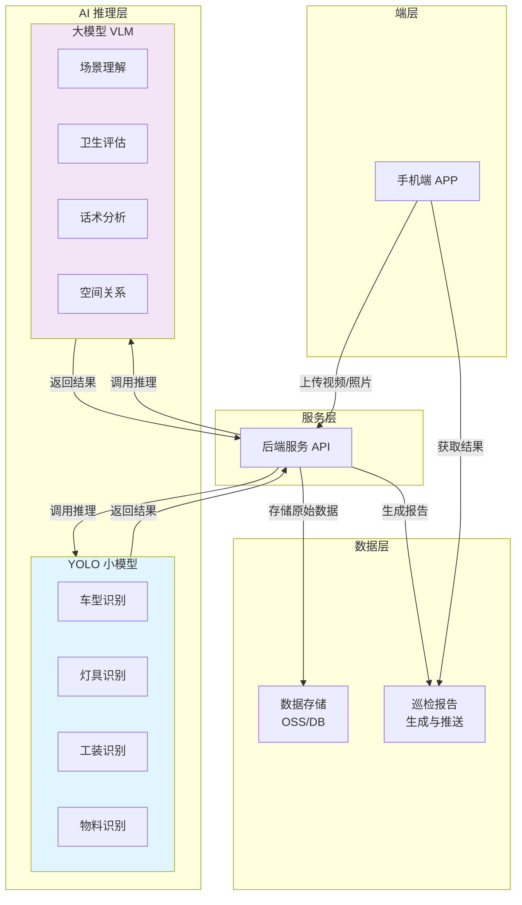
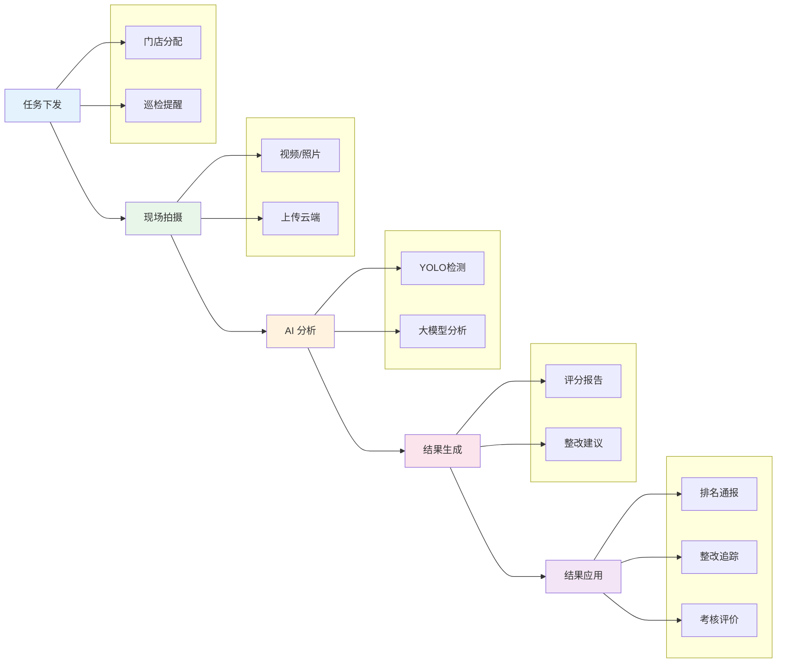

# 雅迪门店 AI 巡检方案

---

## 一、需求分析

### 1.1 项目背景

雅迪门店巡检工作面临门店数量多、分布广、人工巡检成本高等挑战。传统人工巡检模式存在效率低、标准不统一、数据难以追溯等问题。为提升门店管理效率，规范门店形象，需引入 AI 技术实现智能化巡检。

### 1.2 巡检目标

通过 **6 大 AI 能力**，手持拍摄 **1+N 个视频/照片**，智能检核 **5 大项 38 条评分项**，实现门店巡检的自动化、标准化、数字化。

### 1.3 核心需求拆解

#### 1.3.1 室内巡检需求

| AI 能力          | 具体功能                                                                   | 技术要求             |
| -------------- | ---------------------------------------------------------------------- | ---------------- |
| **AI 车型识别**    | ① 识别出现的雅迪车型 ② 按车型计数，重复拍摄去重 ③ 判断车型所处门店空间位置                        | YOLO 小模型识别，关注准确率 |
| **AI 灯光识别**    | ① 识别灯具类型，判断基本明暗情况 ② 识别判断灯具损坏、部分亮情况                                  | YOLO 小模型或大模型     |
| **AI 物料及卫生识别** | ① 识别公司派发物料 vs 自制物料 ② 识别车身薄膜等物品 ③ 判断整体环境脏乱情况（百分比值） ④ 识别针对性垃圾杂物 | 大模型 + YOLO 结合    |
| **AI 试骑车识别**   | ① 识别视频中启动试骑车、仪表盘通电亮灯 ② 计数试骑车数量，重复拍摄去重                               | 视频分析 + 去重算法      |
| **AI 工装识别**    | ① 识别公司售卖多套工装 ② 判断自制工装                                               | YOLO 小模型         |
| **AI 话术识别**    | ① 转写视频中导购语音 ② 判断话术是否合格                                              | ASR 语音转写 + 大模型分析 |

#### 1.3.2 室外巡检需求

| 巡检项目 | 评分细则 |
|---------|---------|
| **门头灯** | ① 未在规定时间亮灯（-10 分） ② 损坏或部分亮（-10 分） ③ 怼拍或故意遮挡导致看不见门头（-10 分） |
| **橱窗灯** | ① 未在规定时间亮灯（-10 分） ② 损坏或部分亮（-10 分） ③ 怼拍或故意遮挡导致看不见橱窗灯（-10 分） |
| **物料卫生** | ① 怼拍或故意遮挡导致局部无法看到（-10 分） ② 自制物料（对联、福字、气球、彩带、红花、小红旗、灯笼、招聘广告、贴纸、维修车行、电话号码、维修等字样 LED 屏幕）（-10 分） ③ 过期物料（包柱、吊旗、横幅、非王鹤棣橱窗贴等）（-10 分） ④ 店外卫生（门头/墙壁/门柱/橱窗玻璃灰尘脏污、地面维修工具散乱、车辆摆放不整齐等）（-10 分） |

### 1.4 关键挑战

1. **识别准确性**：YOLO 小模型对车型、物料、工装的识别准确率需达到业务可用水平
2. **去重逻辑**：重复拍摄的车型、试骑车需智能去重
3. **空间感知**：判断车型在门店中的位置，生成空间场景
4. **环境评估**：卫生脏乱情况的百分比评估需具备可解释性
5. **防作弊检测**：识别怼拍、故意遮挡等作弊行为

---

## 二、技术方案

### 2.1 总体架构

采用**"大模型 + YOLO 小模型"**融合架构，充分发挥两者优势：

- **YOLO 小模型**：负责特定目标的快速检测和定位（车型、灯具、工装、物料等）
- **大模型（VLM）**：负责复杂场景理解、语义分析、综合判断（卫生评估、话术分析、空间关系）

### 2.2 模型分工设计

| 功能模块 | YOLO 小模型 | 大模型（VLM） |
|---------|-------------|---------------|
| **车型识别** | 检测车型位置、分类车型 | 辅助判断车型细节、空间位置 |
| **灯光检测** | 检测灯具位置、数量、亮灭状态 | 判断整体明暗、损坏程度 |
| **物料识别** | 识别公司标准物料、自制物料 | 判断物料合规性、过期情况 |
| **工装识别** | 检测工装数量、类型 | 判断工装规范性 |
| **卫生评估** | 检测垃圾、杂物位置 | **主导**：整体卫生百分比评分 |
| **话术分析** | - | **主导**：语音转写、话术合规判断 |
| **防作弊** | - | **主导**：检测怼拍、遮挡行为 |
| **空间关系** | - | **主导**：理解门店空间布局 |

### 2.3 关键技术点

#### 2.3.1 YOLO 小模型训练

- **数据集构建**：收集雅迪各车型、标准物料、工装、灯具等样本图片
- **标注规范**：BBox 标注 + 类别标签
- **模型选型**：YOLOv8 / YOLO11，平衡速度与精度
- **部署优化**：TensorRT / ONNX 加速，支持边缘端推理

#### 2.3.2 大模型应用

- **基座模型**：选用支持中文的多模态大模型（如 GPT-4V、Claude 3、Qwen-VL 等）
- **Prompt 工程**：设计标准化巡检 Prompt，输出结构化评分结果
- **Few-shot 学习**：提供典型场景样例，提升判断准确性

#### 2.3.3 去重算法

- **基于特征的重复检测**：使用图像特征（如 CLIP 特征）计算相似度
- **时空去重**：结合拍摄时间、地理位置信息判断是否为重复拍摄

#### 2.3.4 防作弊检测

- **怼拍检测**：分析图像模糊度、距离过近特征
- **遮挡检测**：识别异常遮挡物、局部黑块

---

## 三、产品方案

### 3.1 系统组成

采用**"手机端 APP + 后端服务"**的产品形态：

#### 3.1.1 手机端 APP

| 模块 | 功能描述 |
|------|---------|
| **拍摄引导** | 智能引导用户拍摄所需角度、场景，确保覆盖全部评分项 |
| **实时预览** | 拍摄时显示检测框，实时反馈识别结果 |
| **任务管理** | 展示待巡检门店列表，记录巡检进度 |
| **离线支持** | 支持弱网/离线环境下缓存拍摄，联网后自动同步 |
| **结果查看** | 展示 AI 巡检结果、扣分项明细、整改建议 |
| **人工复核** | 支持对 AI 结果存疑时提交人工复核 |

#### 3.1.2 后端服务

| 模块 | 功能描述 |
|------|---------|
| **任务调度** | 分配巡检任务，管理任务状态 |
| **AI 推理服务** | 接收上传的图像/视频，调用 AI 模型进行推理分析 |
| **模型管理** | YOLO 模型版本管理、大模型接口管理 |
| **结果聚合** | 整合多模态分析结果，生成标准化巡检报告 |
| **数据存储** | 存储巡检原始数据、分析结果、历史记录 |
| **报表统计** | 门店得分统计、区域排名、趋势分析 |
| **人工审核** | 提供人工审核界面，处理存疑或申诉案件 |

### 3.2 业务流程

### 3.3 部署方案

| 层级 | 部署方式 | 说明 |
|------|---------|------|
| **手机端** | iOS/Android APP | 原生或 Flutter 跨平台开发 |
| **API 网关** | 云服务器 / K8s | 统一接口管理、限流、鉴权 |
| **AI 推理** | GPU 云服务器 | YOLO 推理 + 大模型 API 调用 |
| **数据存储** | 对象存储 + 关系型数据库 | 媒体文件存 OSS，业务数据存 RDS |

---

## 四、风险与应对

| 风险点 | 应对策略 |
|-------|---------|
| **模型准确率不足** | 持续收集真实场景数据迭代优化；设置人工复核机制 |
| **门店环境差异大** | 采集多样化样本训练；增强模型泛化能力 |
| **拍摄质量不稳定** | APP 端增加拍摄引导和质检；拒绝低质量上传 |
| **大模型成本过高** | 优先使用小模型处理；大模型仅用于复杂场景；探索本地部署方案 |

---

*文档版本：v1.0*
*更新日期：2026-03-31*
